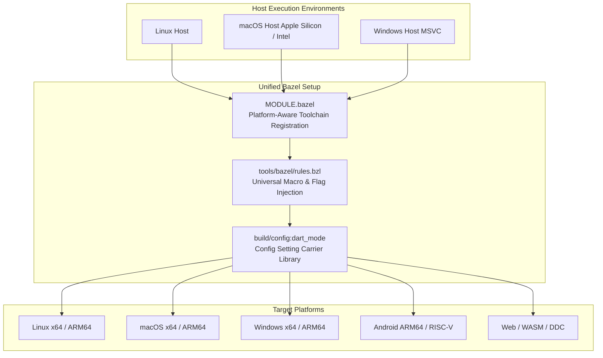

# 🌐 Multi-Platform Dart SDK in Bazel: Architectural Vision & Validation Strategy

> **User Request:**
```
one of the BIG concerns about bazel is the multi-platform aspect. Can we have a single bazel "setup" that can work with linux, mac, windows, android, etc etc

ponder a few validation steps you, mac agent, could do to either (1) increase our confidence in bazel-for-dart or (2) point out holes in our implementation so far

/just-brainstorm
```

---

## Executive Summary

One of the largest architectural questions in migrating the Dart SDK from GN/Ninja to Bazel is whether a **single unified Bazel workspace** can cleanly support the full matrix of host platforms (Linux, macOS, Windows) and target platforms (Android, iOS, Fuchsia, Web, Linux, macOS, Windows) across x86_64, ARM64, and RISC-V.

**The short answer is YES.** While GN/Ninja achieves multi-platform by requiring separate build output directories generated with different command-line args (e.g. `out/ReleaseX64`, `xcodebuild/ReleaseARM64`), Bazel is natively designed for multi-platform graph resolution via **Bzlmod Toolchain Registration**, **Platform Constraints (`@platforms//os`, `@platforms//cpu`)**, and **Starlark `select()` Carrier Libraries**.

However, an empirical audit of the current workspace reveals significant **holes and blindspots** that must be resolved to turn this vision into reality.

---

## 🔍 Part 1: Empirical Audit of Current Platform Holes

An inspection of our current repository state reveals where the build graph is already multi-platform ready and where critical gaps remain:

| Component | Current State | Multi-Platform Gap / "Hole" |
| :--- | :--- | :--- |
| **Toolchain Registration**<br>[MODULE.bazel](file:///Users/kevmoo/github/dart-sdk/bazel/main/sdk/MODULE.bazel) | Registers `clang_x64_toolchain` & `clang_arm64_toolchain` for Linux only. macOS uses autoconfigured Xcode. | **Missing Windows & Android Toolchains**: Zero Bazel toolchains registered for Windows (MSVC/Clang-CL) or Android NDK in [build/toolchain/](file:///Users/kevmoo/github/dart-sdk/bazel/main/sdk/build/toolchain). |
| **Platform Carrier Wrappers**<br>[tools/bazel/rules.bzl](file:///Users/kevmoo/github/dart-sdk/bazel/main/sdk/tools/bazel/rules.bzl) | Injects `DART_TARGET_OS_LINUX` and `DART_TARGET_OS_MACOS` via `select()`. | **Missing OS Selects**: No `select()` cases for `@platforms//os:windows` or `@platforms//os:android`. Windows system libraries (`ws2_32.lib`, `dbghelp.lib`, `bcrypt.lib`) are not yet wired. |
| **Config Setting Matrix**<br>[build/config/BUILD.bazel](file:///Users/kevmoo/github/dart-sdk/bazel/main/sdk/build/config/BUILD.bazel) | Declares debug/release flags, target CPU flags (`target_arch_arm64`, `simarm64`, `riscv64`), and macOS release linkopts. | **Unwired Target OS Flags**: Target OS is currently inferred from host platform constraints rather than dynamic configuration transitions. |
| **Platform Target Definitions**<br>[build/platforms/BUILD.bazel](file:///Users/kevmoo/github/dart-sdk/bazel/main/sdk/build/platforms/BUILD.bazel) | Defines `linux_arm64`, `android_arm64`, `fuchsia_x64`, `fuchsia_arm64`. | **Incomplete Platform Matrix**: Missing standard target platforms for `windows_x64`, `windows_arm64`, `macos_x64`, `macos_arm64`, and `ios_arm64`. |
| **Third-Party Fetchers**<br>[tools/bazel/third_party.bzl](file:///Users/kevmoo/github/dart-sdk/bazel/main/sdk/tools/bazel/third_party.bzl) | macOS support added for Firefox (`.pkg` unpacking); Linux tarballs used elsewhere. | **Non-Hermetic Host Assumptions**: D8 and ChromeDriver still return early or fail on non-Linux/non-macOS hosts. |

---

## 🏛️ Part 2: Architectural Options for Unified Multi-Platform

How do we structure a single Bazel setup so any developer or CI runner on any OS can build and cross-compile any target?



### Option A: Host-Auto-Configured + Hermetic Cross Toolchains (Recommended)
* **Design**: Use local host toolchains for native builds (Xcode on macOS, MSVC on Windows, Hermetic Clang on Linux) while registering hermetic LLVM/Clang and Android NDK toolchains for cross-compilation.
* **Pros**: 
  - Zero friction for native macOS and Windows developers (uses standard developer tools without downloading 2GB sysroots).
  - Maximizes caching and build reproducibility on Linux CI and RBE.
* **Cons**: Requires maintaining flag normalization logic in [tools/bazel/rules.bzl](file:///Users/kevmoo/github/dart-sdk/bazel/main/sdk/tools/bazel/rules.bzl) to handle differences between MSVC flags (`/std:c++17`) and Clang flags (`-std=c++17`).

### Option B: Fully Hermetic LLVM Everywhere (All Hosts)
* **Design**: Download and use a single prebuilt LLVM/Clang toolchain binary distribution for Linux, macOS, and Windows.
* **Pros**: 100% identical compiler binary across all host machines. Eliminates host compiler version drift.
* **Cons**: High initial setup complexity for macOS SDK headers (requires extracting macOS SDK frameworks hermetically) and Windows CRT/WinSDK headers.

---

## 🧪 Part 3: Concrete Validation Steps the Mac Agent Can Perform

As a macOS agent operating natively on macOS ARM64 (Apple Silicon), there are concrete validation experiments we can execute right now to increase confidence in the Bazel setup or expose remaining gaps:

### 1. Target Platform Resolution & `cquery` Dry-Run (Fast & Safe)
* **Experiment**: Test how Bazel resolves the build graph when targeting other operating systems from our macOS host.
* **Command**:
  ```bash
  bazel cquery "deps(//runtime/bin:dartvm)" --platforms=//build/platforms:linux_arm64
  bazel cquery "deps(//runtime/bin:dartvm)" --platforms=//build/platforms:android_arm64
  ```
* **What it Proves**: Validates whether our `select()` branches in [build/config/BUILD.bazel](file:///Users/kevmoo/github/dart-sdk/bazel/main/sdk/build/config/BUILD.bazel) and [runtime/bin/BUILD.bazel](file:///Users/kevmoo/github/dart-sdk/bazel/main/sdk/runtime/bin/BUILD.bazel) cleanly switch architecture and OS defines without Starlark evaluation errors.

### 2. Native macOS ARM64 vs. x86_64 Dual-Arch Validation
* **Experiment**: Build the Dart VM for both native Apple Silicon (`darwin_arm64`) and Rosetta/Intel (`darwin_x86_64`) on the same Mac host.
* **Command**:
  ```bash
  bazel build //runtime/bin:dartvm --cpu=darwin_arm64
  bazel build //runtime/bin:dartvm --cpu=darwin_x86_64
  ```
* **What it Proves**: Confirms whether our flag filtering in [tools/bazel/rules.bzl](file:///Users/kevmoo/github/dart-sdk/bazel/main/sdk/tools/bazel/rules.bzl) correctly handles architecture transitions without triggering linker target mismatches.

### 3. GN vs. Bazel Flag Equivalence Proof on macOS
* **Experiment**: Compare the exact C++ compiler flags (`cflags`, `defines`, `include_dirs`) emitted by GN in `xcodebuild/ReleaseARM64` against the flags emitted by Bazel's `aquery` for `//runtime/bin:dartvm`.
* **Command**:
  ```bash
  bazel aquery "mnemonic('CppCompile', //runtime/bin:dartvm)" --output=text
  ```
* **What it Proves**: Provides mathematical/empirical proof that the Bazel build on macOS matches GN bit-for-bit in optimization levels, warning suppressions, and macro definitions.

### 4. Windows Path Separator & Runfiles Static Audit
* **Experiment**: Scan all `.bzl` rules and test runner helper scripts for hardcoded POSIX path assumptions (`/`, `File.parent`, `.so` / `.dylib` without `.dll` / `.exe`).
* **What it Proves**: Identifies Windows compatibility bugs *before* running on a Windows builder, enforcing Rule 3.6 of [docs/bazel-migration/GUIDELINES.md](file:///Users/kevmoo/github/dart-sdk/bazel/main/sdk/docs/bazel-migration/GUIDELINES.md).

---

## 🎯 Next Steps & Recommendations

1. **Fill Platform Matrix Definitions**: Add missing platform definitions (`windows_x64`, `macos_arm64`, `macos_x64`, `ios_arm64`) to [build/platforms/BUILD.bazel](file:///Users/kevmoo/github/dart-sdk/bazel/main/sdk/build/platforms/BUILD.bazel).
2. **Expand Carrier Library `select()` Branches**: Update `_inject_local_defines` in [tools/bazel/rules.bzl](file:///Users/kevmoo/github/dart-sdk/bazel/main/sdk/tools/bazel/rules.bzl) to support `@platforms//os:windows` and `@platforms//os:android`.
3. **Execute the macOS `cquery` & `aquery` Validation**: Run the read-only inspection commands above to verify platform graph evaluation from the Mac sandbox.
