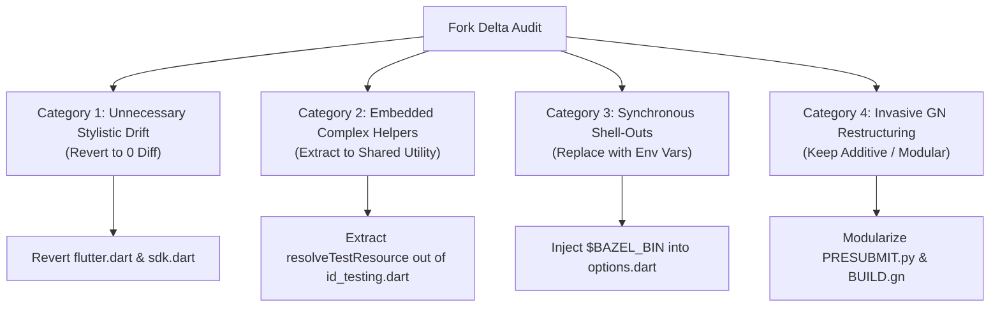

# Fork Delta Cleanup & Surgical Refactoring Candidates (`MERGE_CLEANUP_CANDIDATES.md`)

While `UPSTREAM_CANDIDATES.md` tracks bug fixes and general enhancements that should be sent directly to the canonical Dart SDK repository (`upstream-sdk/main`), this document tracks **places on our Bazel fork where our modifications have been more invasive or "sloppy" than necessary**.

Even where we **must** diverge from upstream to support Bazel, hermetic builds, or runfiles, our goal is to make those deltas as **surgical, decoupled, and minimal as possible** to prevent merge conflicts during weekly `upstream-sdk/lkgr-dev` rolls.

---

## 📋 Cleanup Categories & Action Plan



---

## 🛑 Category 1: Unnecessary Stylistic & Refactoring Drift (Revert to Zero Diff)

These files contain pure syntactic or stylistic rewrites that have zero connection to Bazel migration, hermetic builds, or runfiles. They should be reset to upstream `main` immediately to eliminate pointless diff lines and prevent recurring roll conflicts.

### 1. `pkg/analyzer/lib/src/utilities/extensions/flutter.dart`
* **Current State (`56 +-`)**: Across ~30 getter methods (`isBuildContext`, `isExactEdgeInsetsGeometryType`, etc.), our fork rewrote:
  ```dart
  // Upstream
  return self is InterfaceType &&
      self.nullabilitySuffix == NullabilitySuffix.none &&
      self.element._isExactly(_nameBuildContext, _uriFramework);
  ```
  into:
  ```dart
  // Fork
  if (self is! InterfaceType) return false;
  return self.nullabilitySuffix == NullabilitySuffix.none &&
      self.element._isExactly(_nameBuildContext, _uriFramework);
  ```
* **Why it's sloppy**: This is purely syntactic/stylistic refactoring (`if (is! InterfaceType) return false` vs `is InterfaceType &&`). It touches dozens of lines for zero functional gain and creates permanent Git blame noise and merge conflicts whenever upstream touches Flutter analyzer extensions.
* **Surgical Action**: Revert directly to upstream:
  ```bash
  git checkout upstream-sdk/main -- pkg/analyzer/lib/src/utilities/extensions/flutter.dart
  ```

### 2. `pkg/analyzer/lib/src/util/sdk.dart` & `pkg/analyzer_utilities/lib/tools.dart`
* **Current State**: Minor formatting tweaks, variable renames, and re-ordered imports that diverged from upstream over time.
* **Surgical Action**: Audit diffs against `upstream-sdk/main` and revert all non-functional formatting lines so only genuine Bazel/hermetic path adjustments remain.

---

## 🧪 Category 2: Embedded Complex Helpers in Upstream Packages (Extract to Shared Utility)

Where we must add complex logic to support Bazel runfiles or sandboxed environments, we should never embed multi-page helper functions inside core upstream package files. Instead, extract the helpers into modular utilities so the upstream package diff is a single function call.

### 1. `pkg/_fe_analyzer_shared/lib/src/testing/id_testing.dart` (`resolveTestResource`)
* **Current State (`124 +-`)**: Our fork embedded a 60-line function `resolveTestResource(String runfilesPath, {Uri? baseUri})` directly inside `id_testing.dart`. It checks `RUNFILES_MANIFEST_FILE`, reads `RUNFILES_DIR`, `TEST_SRCDIR`, and probes multiple fallback directories (`_main/`, `+dart_packages_extension+dart_packages/`, etc.).
* **Why it's sloppy**: Embedding 60 lines of complex environment and runfile probing inside `id_testing.dart` clutters the front-end test framework and makes upstream merges painful whenever `id_testing.dart` is refactored upstream. Furthermore, the runfile resolution logic is trapped inside one file instead of being reusable.
* **Surgical Action**:
  1. Move `resolveTestResource` into a centralized, dedicated utility file (e.g., `pkg/analyzer_testing/lib/package_root.dart` or a standalone `pkg/testing/lib/src/runfiles.dart`).
  2. In `id_testing.dart`, replace the 60-line block with a clean 1-line import and call:
     ```dart
     final resolvedUri = runfiles.resolveTestResource(runfilesPath, baseUri: baseUri);
     ```

---

## ⚡ Category 3: Synchronous Shell-Outs inside Test Option Parsing (`options.dart`)

### 1. `pkg/test_runner/lib/src/options.dart` (`--built-with-bazel`)
* **Current State (`62 +-`)**: When `--built-with-bazel` is passed, `OptionsParser.parse` synchronously shells out to the Bazel Java daemon to query the build directory:
  ```dart
  var result = Process.runSync('bazel', [
    '--noblock_for_lock',
    '--local_startup_timeout_secs=120',
    'info',
    'bazel-bin',
  ]);
  options['build-directory'] = path.join(result.stdout.toString().trim(), 'sdk');
  ```
* **Why it's sloppy**: Shelling out (`Process.runSync`) during command-line option parsing adds noticeable startup latency and introduces complex failure modes (`ProcessException`, lock timeouts, string parsing errors) right inside the test runner's argument parser.
* **Surgical Action**:
  1. Require the invoking script (`test.py`, `presubmit.sh`, or the user's shell) to pass `--build-directory` explicitly or set a `$BAZEL_BIN` environment variable.
  2. Replace the 30-line `Process.runSync` block in `options.dart` with a simple environment lookup:
     ```dart
     if (options['built-with-bazel'] == true) {
       options['use-sdk'] = true;
       options['build'] = false;
       final bazelBin = Platform.environment['BAZEL_BIN'] ??
           options['build-directory'] as String?;
       if (bazelBin == null) {
         _fail('When using --built-with-bazel, provide --build-directory or set $BAZEL_BIN.');
       }
       options['build-directory'] = path.join(bazelBin, 'sdk');
     }
     ```

---

## 🏛️ Category 4: Invasive GN Target Restructuring (`runtime/BUILD.gn`)

### 1. `runtime/BUILD.gn` & `runtime/bin/BUILD.gn`
* **Current State**: Our fork modified target source lists and dependencies (`source_set("dart_api")` replaced individual header listings with `public_deps = [ "include:public_api_headers" ]`, `"vm:libdart_lib"` moved to `"lib:libdart_lib"`, and `generate_version_cc_file` inputs were restructured).
* **Why it's sloppy**: Modifying the core GN targets inline creates merge conflicts whenever upstream adds or removes source files or dependencies from `runtime/BUILD.gn` during weekly rolls.
* **Surgical Action**:
  * For changes that aren't strictly required for GN compilation (e.g. Bazel target definitions), keep them entirely inside `BUILD.bazel` files rather than restructuring `BUILD.gn`.
  * Where `BUILD.gn` targets must be modified to share configs, use additive list appends at the bottom of the file (`source_set("dart_api") { ... }` or adding a secondary `.gni` import) rather than rewriting existing GN source lists in place.

---

## 🛠️ Category 5: Tooling & Presubmit Hooks (`PRESUBMIT.py` & `tools/build.py`)

### 1. `PRESUBMIT.py` (`_CheckBuildifier`) & `tools/build.py` (`--bazel`)
* **Current State**: We inserted a 35-line `_CheckBuildifier` function into `PRESUBMIT.py` and a 70-line `BuildWithBazel` / `BAZEL_TARGET_MAPPING` block into `tools/build.py`.
* **Why it's sloppy**: Adding multi-page functions and dictionaries directly into upstream Python tooling scripts makes git diffs bulky and prone to conflicts during upstream tooling refactors.
* **Surgical Action**:
  1. Create modular fork utilities: `tools/bazel/presubmit_checks.py` and `tools/bazel/build_wrapper.py`.
  2. Keep the modifications in `PRESUBMIT.py` and `tools/build.py` down to a 2-line hook:
     ```python
     # In PRESUBMIT.py
     import tools.bazel.presubmit_checks as bazel_checks
     results.extend(bazel_checks.check_buildifier(input_api, output_api))
     ```

---

## 🎯 Summary Checklist for Surgical Cleanup
- [ ] Revert `flutter.dart` and `sdk.dart` to upstream (`git checkout upstream-sdk/main -- ...`).
- [ ] Extract `resolveTestResource` from `id_testing.dart` to `pkg/analyzer_testing/lib/package_root.dart`.
- [ ] Replace `Process.runSync('bazel info...')` in `options.dart` with `$BAZEL_BIN` environment lookup.
- [ ] Modularize `PRESUBMIT.py` and `tools/build.py` hooks into `tools/bazel/*.py` imports.
