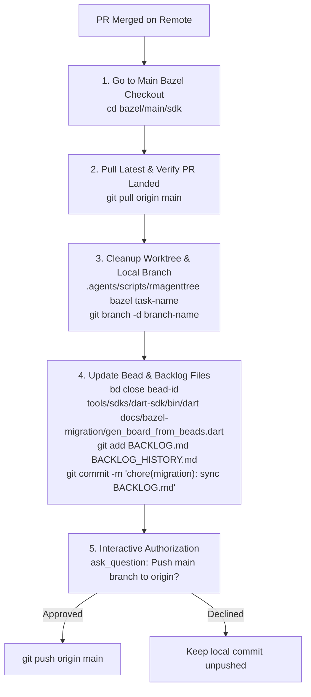

# Dart SDK Post-Merge Cleanup & Bead Closing (`dart-sdk-cleanup-bead`)

This skill defines the standard protocol for cleaning up task worktrees, closing beads issues, updating backlog markdown documentation, and syncing local `main` with remote after a PR has been merged on the **Bazel thread (`bazel`)**.

---

## When to Use This Skill

- Trigger when a PR has landed/merged on GitHub and you need to close out a task, clean up sandbox worktrees/branches, and update the backlog.
- Use when requested to "clean up bead", "close bead <id>", "tear down worktree after merge", or "sync backlog after PR landed".

---

## 📋 Step-by-Step Execution Protocol



### 1. Go to Main Bazel Checkout
Navigate to the primary persistent main checkout for the `bazel` thread:
```bash
cd /usr/local/google/home/kevmoo/github/dart-sdk/bazel/main/sdk
```

### 2. Pull Latest & Confirm PR Landed
Pull the latest changes from the primary remote `origin/main` to verify the PR commit has landed:
```bash
git pull origin main
```
Confirm `git log -n 5` contains the merged PR commit.

### 3. Cleanup Worktree and Branch
Reclaim disk space by deleting the task sandbox worktree and local branch:
```bash
# Remove the sandbox worktree
.agents/scripts/rmagenttree bazel <task-name>

# Delete the local feature branch (if it exists)
git branch -d <branch-name>
```

### 4. Update Bead and Backlog Files
Close the corresponding bead issue in the local database and regenerate the backlog markdown documentation:
```bash
# Close the bead
bd close <bead-id>

# Regenerate backlog markdown boards
tools/sdks/dart-sdk/bin/dart docs/bazel-migration/gen_board_from_beads.dart

# Stage and commit updated backlog files locally
git add docs/bazel-migration/BACKLOG.md docs/bazel-migration/BACKLOG_HISTORY.md
git commit -m "chore(migration): sync BACKLOG.md after closing bead <bead-id>"
```

### 5. Offer to Push using `ask_question`
Use `ask_question` to ask the user for authorization to push the local commit and sync Dolt remote:
- Option 1: `(Recommended) Yes, push commit to origin/main and sync Dolt remote`
- Option 2: `No, keep local commit unpushed for now`

If approved, run:
```bash
git push origin main
bd dolt push
```
